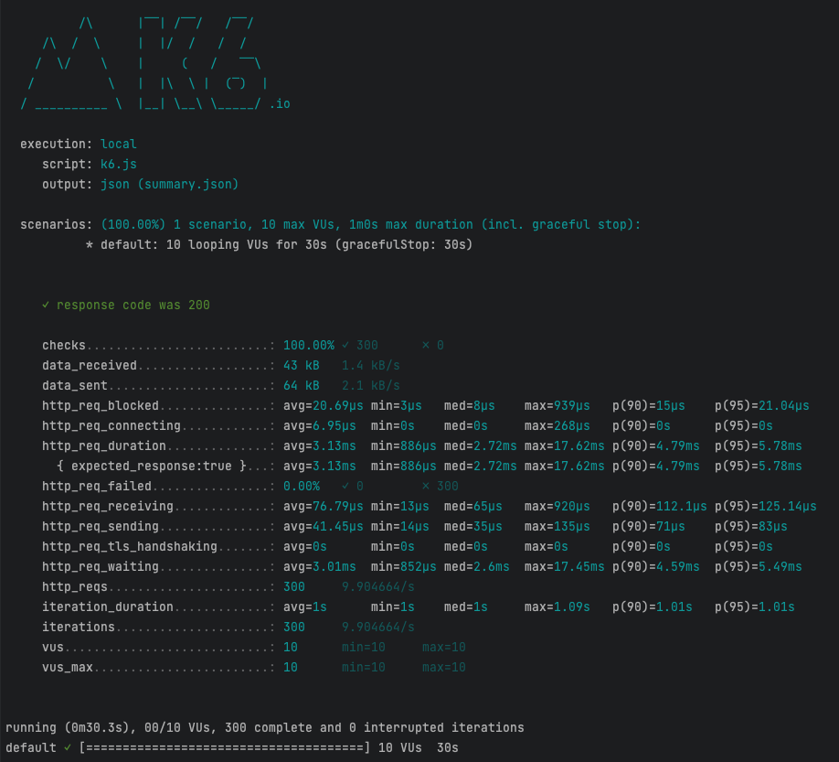

# Take-Home Programming Assignment for Golang



## Story

There are over 100,000 flights a day, with millions of people and cargo being transferred around the world. With so many
people and different carrier/agency groups, it can be hard to track where a person might be. In order to determine the
flight path of a person, we must sort through all of their flight records.

## Goal

To create a simple microservice API that can help us understand and track how a particular person's flight path may be
queried. The API should accept a request that includes a list of flights, which are defined by a source and destination
airport code. These flights may not be listed in order and will need to be sorted to find the total flight paths
starting and ending airports.

### Required JSON structure:

- [["SFO", "EWR"]]                                                                           => ["SFO", "EWR"]
- [["ATL", "EWR"], ["SFO", "ATL"]]                                                   => ["SFO", "EWR"]
- [["IND", "EWR"], ["SFO", "ATL"], ["GSO", "IND"], ["ATL", "GSO"]] => ["SFO", "EWR"]

## Prerequisites

You will need :

- **Go 1.20**
- **Docker Desktop / Docker Compose**

# Quick start

### Run the server

```shell
make run-server
```
### Cleanup
```shell
make clean
```
***

## Useful commands

```shell
make lint
make test
make build
make run-server # to run the server
make k6 # To simulate multiple requests in the same time using k6
make run-e2e-tests # To run e2e test 
```

***

## Available Routes

- GET `/_health` health endpoint
- POST `/track`  Track endpoint

# Health Endpoint

```shell
curl -L \
  -H "Accept: application/json" \
  http://localhost:8080/_health
```

# Track Endpoint

```shell
curl --location --request POST \
  -H "Accept: application/json" \
  -H 'Content-Type: application/json' \
  -d  @testdata/payload.json \
  http://localhost:8080/track
```

## Response

```shell
HTTP/1.1 200 OK
Date: Sat, 11 Mar 2023 03:16:48 GMT
Content-Type: application/json
Content-Length: 36

{
  "source": "SFO",
  "destination": "EWR"
}
```

***

# Executing end-to-end tests

> **Please note** that in order to execute E2E tests, you will require the installation of Docker Desktop and Docker
> Compose.

```shell
make run-e2e-tests
```

# Running k6 script
**Prerequisites:** 
- Mac Users : `brew install k6`
- Linux : [Check the link](https://k6.io/docs/get-started/installation/#linux)
- Windows : [Check the link](https://k6.io/docs/get-started/installation/#windows)

```shell
make k6
```